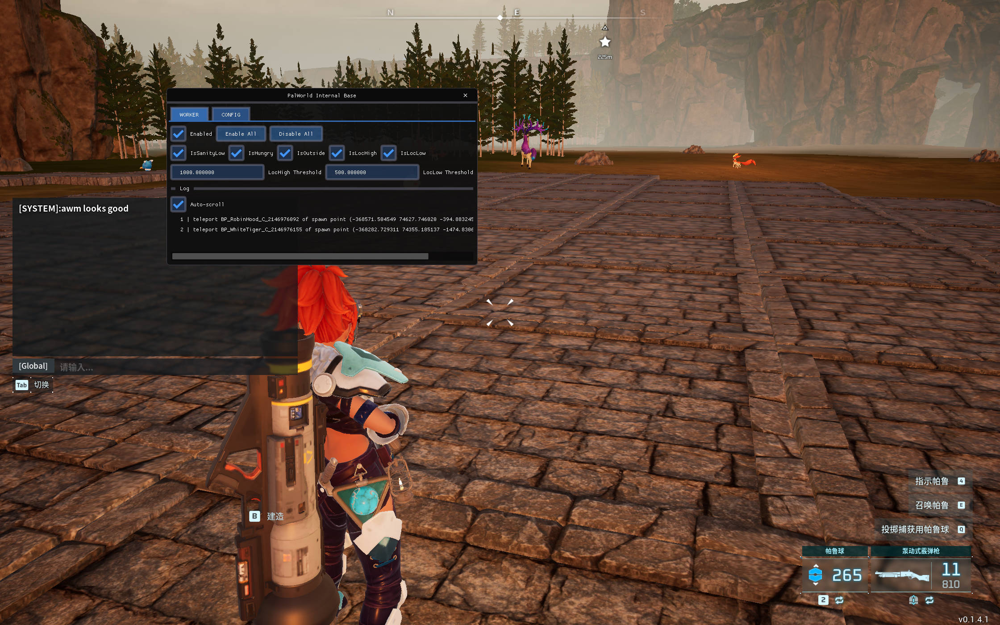

# AbnormalWorkerManager (AWM)

A Palworld mod to monitor some abnormal cases for base camp pal workers.

Current features:

- teleport pal worker with abnormal spawn point to its base camp on mod load.
- teleport pal worker of abnormal cases to its base camp.
  - sanity low (< 50)
  - hungry
  - outside base camp
  - too low (distance configurable)
  - too high (distance configurable)

#### Usage

Install the mod, enter game, enter world, press key `insert` (on laptop maybe `fn + insert`), wait for a while and you'll see a chat message says "awm looks good", press `insert` to switch the mod window, click `WORKER` to switch to the tab for AWM.

**Please always press first `insert` after you enter the world**, but it is ok to press `insert` again to show the mod window before the chat message.



Note that tabs other than "WORKER" are from Palworld-Internal and Palworld-NetCrack.

#### Install

##### Universal Ones

Any method to inject the dll into the game. The following are some methods.

##### D3D9 wrapper

See the [dll loader for palworld released on nexusmods](https://www.nexusmods.com/palworld/mods/372), follow it's instructions, the final folder structure should be like:

```
Pal/
├── Binaries/
│   ├── Win64/
│   │   ├── Palworld-Win64-Shipping.exe
│   │   ├── d3d9.dll
│   │   └── Plugins
│   │       └── AbnormaWorkerMonitor.dll
├── Content/
└── Plugins/
```

The mod name `AbnormaWorkerMonitor.dll` can be changed.

##### PalLauncher

Download `PalLauncher.exe` in the release page, put it into the same directory with the mod file, **enter game world first**, run `PalLauncher.exe` (you won't see anything as it just works on background), then press `insert`...

The mod name `AbnormaWorkerMonitor.dll` must not be changed.

#### Build

Clone the repo, openthe `.sln` file in root directory, build solution `AbnormaWorkerMonitor` with configuration `Release`, in the `bin` directory you would find the `.dll` mod file.

#### Known Issues

**Not tested on server**, mayber later, I would appreciate if you share your test results or ideas or anything else on this or anything related to this mod.

Crashes if you reenter a world, also not implement to handle so, **restart the game after you leave a world plz**, I don't know an elegant way to handle this and prefer to do later.

The mod sleeps for 30 seconds when loaded (before listening to `insert`), if you computer is fast, **you may need to wait for a while before the mod listening to you key press**.

#### Gossips

I use sliding window based on time to determine if pal worker of abnormal cases should be teleported. **In short, pal won't be teleported onced it matches any of the abnormal cases, but will be teleported only if it matches the cases several times during a time period**. If you prefer the instant teleport, see `AbnormalWorkerManager::init_time_windows_and_cooldown()` and there's a commented version to do so.

The purpose of this project is to mend the weird game behaviors, However, this project, based on [Palworld-Internal](https://github.com/NightFyre/Palworld-Internal), which appears more like a game mod to gain superpower, retains the original features while adding new features. **If seeing the UI that provides superpower functions in the game displeases you, you can download the `clean` version (remove the suffix "_clean" if you use `PalLauncher`)**. This version removes the window tabs related to the Palworld-Internal features, but note that it still keeps the "PalWorld-NetCrack" watermark at the top of the screen.

Please make a star if you like this project.


#### Acknowledgement

[Palworld-Internal](https://github.com/NightFyre/Palworld-Internal) integration of pal c++ api, game tick hooking, ui injection, dll injection

[PalWorld-NetCrack](https://github.com/Chaos192/PalWorld-NetCrack) the original project of the former

[Dear ImGui](https://github.com/ocornut/imgui)

[MinHook](https://github.com/TsudaKageyu/minhook)

[Dumper7](https://github.com/Encryqed/Dumper-7)

[DX11-Internal-Base](https://github.com/NightFyre/DX11-ImGui-Internal-Hook)

[Palworld Reversal, Structs and Offsets](https://www.unknowncheats.me/forum/palworld/620076-palworld-reversal-structs-offsets.html)
